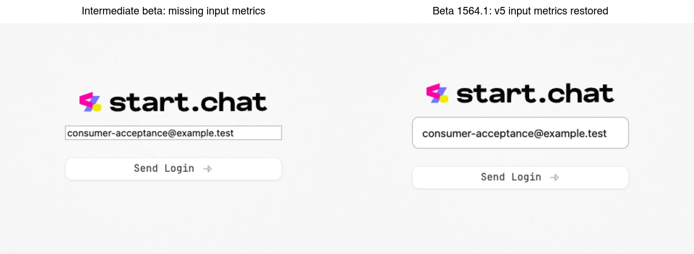
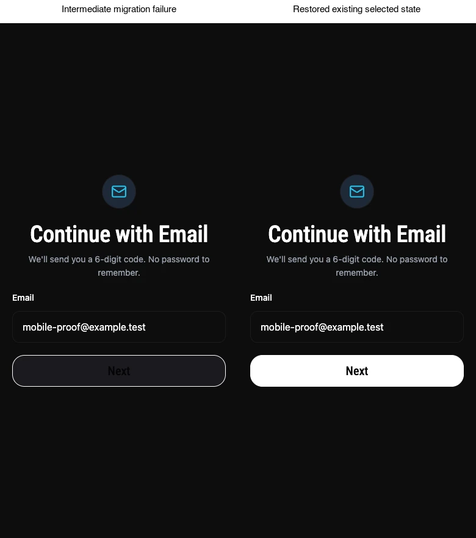

# Tamagui launch consumer acceptance, 2026-10-03

Owner: launch-tamagui-consumers (s8065). Parent: r54299.
Scope: chat, takeout, 3pc. REVIEW: none, reviewed with the assembled launch.

## Result

TESTED: all three consumers use the coherent published `3.0.0-beta.1564.1` set. Their consumer migrations are committed and pushed, with production web runtime proof and fresh iOS exports. Tamagui v6 defaults and public APIs were not changed. One source, Tamagui site/blog/bento, and `v2-beta-starter` were untouched. Teleport setup remains in every native consumer.

| Consumer | Pushed branch | Final SHA |
| --- | --- | --- |
| [chat](https://github.com/onejs/chat/tree/launch/tamagui-v3-consumer) | `launch/tamagui-v3-consumer` | `80926ff93` |
| [takeout](https://github.com/tamagui/takeout2/tree/launch/tamagui-v3-consumer) | `launch/tamagui-v3-consumer` | `42bc63c3` |
| [3pc](https://github.com/lightstrikelabs/three-punch-convo-app/tree/launch/tamagui-v3-consumer) | `launch/tamagui-v3-consumer` | `4f48ee228390a4b9c5f146c76c2ca280d9b4fe05` |

These are consumer branches for assembled launch acceptance. No One or Tamagui main push, deployment, release, board edit, or external account mutation occurred.

## Published artifact

RAN: `tamagui@beta` selected `3.0.0-beta.1564.1`, published 2026-10-03T11:39:38.378Z. Auto-publishing remains enabled; this receipt validates a fixed snapshot rather than chasing later tags.

- Registry `gitHead`: `a49cc7ea6b93ba384e77a4880ae48ac4a5635c14`.
- Downloaded tarball SHA-1: `d6d508fd56fc9e253c1f67bc8b192aaa87b42c46`, matching registry metadata.
- Registry integrity: `sha512-w3qvDUtrBnCpPbDySX2LkFZXnw2RG3ITALYJyfhjko1QLBtabkfGUp09Q2S4xgR0OEtIhs4qQInXgpt9aiysKA==`.
- RAN: `cmp` of the tarball's `dist/esm/index.mjs` against each consumer's installed file returned success. This verifies that entry file's content; it is not a claim that every file in every transitive package was compared.
- RAN: 3pc's existing dedupe script reports **129 Tamagui packages at one version**. Its syncpack Tamagui filter passed. Chat and Takeout manifests, overrides, and locks were upgraded as complete sets too.

## Recovery and scope

RAN: fetched and read origin/v3-beta's README, finish-line, and migration receipts before editing. Historical evidence remains in those receipts and is not presented as current-beta validation.

| Consumer | Recovered base | Work completed |
| --- | --- | --- |
| chat | `a5cdfe82b8c014f2b458d0d1bfcc71e53b40146d`, origin/upgrade/one-v2-tamagui-v3 | retained the existing migration and framework upgrade; finished remaining v3 compatibility and fresh acceptance |
| takeout | `d614d5b3457147feac22f9a48080deb4d3a4b3b6`, origin/beta/one-tamagui-v3-rolldown | recovered 147 proven migration files from `649b2a0e` only where the selected base still exactly matched baseline `d6199b193aa44ad05246e884fad56ac9a1316c95`; preserved 14 newer files |
| 3pc | `d9d7e9ca9cc1fd01851e53128f129e9b0af2f1dc`, origin/main | migrated its v2 canary source, retaining One 1.20.2 and React Native 0.83.6 |

The published flat-values codemod ran with `--source-semantics v2-pixels`. It touched 143 Takeout files and 218 3pc files. Remaining API edits preserve consumer behavior: flat conditional styles, v5 themes, input sizing, Select/Popover/Dialog anatomy, Sheet transition callbacks, and wrapper metadata. Existing tests exposed and verified fixes to selected-button backgrounds and theme-color resolution. Stale class-name assertions now check computed styles; no retries, skipped tests, relaxed assertions, or timeout increases were added.

The retired `lucide-icons-2` dependency cannot participate in the current whole beta set. Published CLI-generated local icons and `helpers-icon` replace it. Chat has one generated Search icon; 3pc has 73 icons, including four brand SVGs retaining their original paths. The obsolete 3pc lucide Babel transform and its dedicated test were removed with the dependency.

## Current acceptance

### Chat

TESTED:

- Full TypeScript passed.
- Production web build passed, including 128 pages and its security scan.
- Existing public launch verifier passed: 10 surfaces, 36 internal links, 90 sitemap locations, Chrome/Metal browser runtime.
- Login probe passed typing, value, focus, and minimum-height checks.
- Fresh iOS export passed with the documented `main: one/metro-entry` wiring restored in `80926ff93`.

RAN: computed browser Input metrics are **44px height, 7px vertical and 13px horizontal padding, 15px font, 24px line height, 9px radius, 1px border**. The 300px width belongs to the existing login form. The earlier 42px statement was wrong. Explicit sizing in Chat's wrapper replaces a retired numeric skin size; `createStyledHOC` retains metadata for styled consumers such as Table. These changes do not change Tamagui's defaults.

Left is an intermediate migration failure, right is the corrected production field. Neither is labeled as a captured pre-upgrade baseline.

Logs on air-32: `/tmp/launch-chat-types-accepted.log`, `/tmp/launch-chat-web-build-accepted.log`, `/tmp/launch-chat-runtime.log`, `/tmp/launch-chat-input-proof-accepted.log`, `/tmp/launch-chat-native-export-final.log`.

### Takeout

TESTED:

- Eight package builds and full `bun check` passed, including types, formatting, lint and dependency analysis.
- Production web build passed, including all 20 docs. `ALLOW_MISSING_ENV=1` was used for local validation only.
- Existing unit suite: **75 passed**.
- Existing login integration selection: **4 passed**, `--workers=1 --retries=0`.
- Fresh iOS export passed after restoring the previously documented Babel/Metro configuration and removing the obsolete native gradient setup import in `42bc63c3`.
- Production desktop and mobile probes opened the email flow, filled its input, checked value/focus/visibility, and reported no page errors. Computed field height: **50px**.

[Desktop proof](assets/launch-consumers-2026-10-03/takeout-email-desktop.webp) · [Mobile proof](assets/launch-consumers-2026-10-03/takeout-email-mobile.webp)

Logs on air-32: `/tmp/launch-takeout-check.log`, `/tmp/launch-takeout-web-build-final.log`, `/tmp/launch-takeout-unit.log`, `/tmp/launch-takeout-runtime-final.log`, `/tmp/launch-takeout-native-export-accepted.log`, `/tmp/launch-consumer-web-proof-final.log`.

### 3pc

TESTED:

- Full UI/frontend/One TypeScript selection and its dependencies: **5 tasks passed**.
- Production web build and Cloudflare worker bundling passed. Nothing was deployed.
- Existing UI suite: **12 files, 52 tests passed**.
- Existing frontend suite: **275 files passed** in the final full run. The remaining badge file had one assertion expecting CSS `white` instead of configured `#FFFFFF`; after correction its **6 tests passed** in a targeted rerun. Combined evidence covers all **276 files and 2529 tests**, not a claim of one fully green invocation.
- UI lint passed. Frontend lint passed with **0 errors, 42 warnings**.
- Fresh iOS export passed: **3637 modules, 12MB Hermes bundle**. Used the repo's existing `ONE_DISABLE_NATIVE_SERVER_ROOT_PIN=1` environment switch with Expo export; One source was unchanged.
- Production home and login loaded without page errors. Final desktop/mobile probes opened `/signup/email`, filled the field and checked value/focus/visibility. Computed field height: **52px**. The final capture restores the selected Next button's existing bright background and dark text.

Left is the intermediate migration failure, right is the final production build, not a pre-upgrade baseline.

Logs on air-32: `/tmp/launch-3pc-types-final.log`, `/tmp/launch-3pc-web-build-accepted.log`, `/tmp/launch-3pc-ui-tests-accepted.log`, `/tmp/launch-3pc-frontend-tests-accepted.log`, `/tmp/launch-3pc-badge-test-accepted.log`, `/tmp/launch-3pc-ui-lint.log`, `/tmp/launch-3pc-frontend-lint.log`, `/tmp/launch-3pc-native-export-final.log`, `/tmp/launch-consumer-web-proof-final.log`.

## Machine, commands and limits

RAN: tm-selected air-32 had all three consumers and sampled 77.4%/73.16% CPU idle, about 6 GiB unused memory and 131 GiB available disk before heavy work. Later samples showed concurrent load, so heavy work stayed behind `tm window run heavy`, one builder slot, without helpers. All consumer work used isolated `~/.worktrees/<project>-launch-consumer` paths. Shared primary checkouts and dirty 3pc feature edits were preserved.

3pc commands used the repo's pnpm 10.29.3 through Bun and Node 24.3.0 through mise. Builds, typechecks, tests and exports used builder gates. Runtime probes used the existing Playwright installation and production servers; no authenticated submission, billing action, or database migration ran.

Fresh native evidence here is **export/bundle validation, not fresh simulator launch or native dimensions**. Previous simulator and authenticated-flow receipts remain historical. 3pc's One security scanner emitted warnings from third-party bundles; its build passed, but scanner warnings are not counted as a clean security scan. Browser proof covers public/login/email flows, not all authenticated application flows. No current acceptance blocker remains within this mechanical migration scope.
