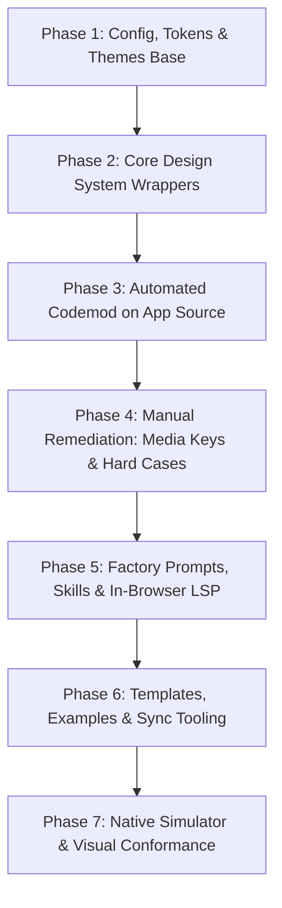

# Tamagui v3 Migration Inventory: Soot (~/soot)

**Author**: Read-only Migration Reviewer  
**Target Repository**: `/Users/n8/soot` (current `main` commit `4f82764765`, evaluated against `v3` branch commit `d5f28c58c8`)  
**Scope**: Full migration from Tamagui v2 + `@tamagui/config/v5` to Tamagui v3 + Config v6 only (no v2, no config-v5).  
**Review Disposition**: `REVIEW: none` (Read-only, no code changes authored).

---

## 1. The Old Migration Branch (`v3`)

### 1.1 Branch History and Commit Summary
- **Merge-base**: `ecd7d5b4ff2b27885be0a309381a5f2d02ee7f42` (*RAN: `git -C ~/soot merge-base main v3`*).
- **Branch age & drift**: `main` has advanced by **1,759 commits** since the branch point (*RAN: `git -C ~/soot rev-list --count ecd7d5b4ff..main`*).
- **Commits on `v3`**: 10 non-merge commits (*RAN: `git -C ~/soot log --oneline --no-merges main..v3`*):
  1. `174cfb6118`: `chore(tamagui): move v5 theme builders to @tamagui/config-v5 and trim the compiler warm-up list`
  2. `fc3aa7e403`: `chore(v3): migrate src/packages/app to tamagui v3 flat values`
  3. `53ed5c4dad`: `wip: tamagui v3 migration in progress`
  4. `f41bb614c6`: `chore(deps): upgrade tamagui dependency set to published version 3.0.0-beta.907.1`
  5. `856ae8f850`: `chore(deps): pin custom native camera fixture to Tamagui beta`
  6. `2730cce3cb`: `chore(v3): finish Tamagui v3 source migration`
  7. `9e7d1d8e93`: `chore(v3): migrate removed Tamagui component APIs`
  8. `2a49c2f185`: `test(v3): verify migrated sprout styles at runtime`
  9. `9a16a0dfd9`: `chore(deps): update Tamagui beta to 3.0.0-beta.917.1`
  10. `d5f28c58c8`: `chore(v3): refresh warm Tamagui dependencies`

### 1.2 Categories of Changes on `v3`
- **Total diff stat against merge-base**: 1,098 files changed, 17,091 insertions(+), 19,932 deletions(-) (*RAN: `git -C ~/soot diff --stat main...v3`*).
- **Codemod flat values**: `fc3aa7e403`, `53ed5c4dad`, `2730cce3cb` converted `$token` literals and condition objects (`hoverStyle`, `pressStyle`, `enterStyle`, `exitStyle`) across `src/`, `packages/`, `templates/`, and `examples/`.
- **Removed APIs**: `9e7d1d8e93` manually eliminated deprecated component structures, notably replacing `Sheet.Frame` across 25+ files, adapting `Dialog` portals/content, cleaning `Input`/`TextArea` props, and adjusting `BlurView.native`.
- **Dependencies**: `f41bb614c6`, `9a16a0dfd9`, `d5f28c58c8` upgraded packages to Tamagui 3.0.0-beta.917.1, updated `bun.lock`, and refreshed `warmDeps.generated.json`.
- **Config**: `174cfb6118` moved dynamic theme builders to `@tamagui/config-v5`—**it did not migrate to Config v6**.

### 1.3 Divergence, Collision Analysis & Rebase Conflict Test
- Files changed on `main` since merge-base: **3,917 files** (*RAN: `git -C ~/soot diff --name-only v3...main | wc -l`*).
- Files changed on `v3` since merge-base: **1,098 files** (*RAN: `git -C ~/soot diff --name-only main...v3 | wc -l`*).
- File intersection: **300 files** (27.3% of `v3`'s total touched files) have been modified concurrently on `main` (*RAN: python intersection check*). Top colliding areas: `src/features` (76 files), `templates/contrast-mobile` (27), `src/contrast` (25), `examples/app-finance` (24), `templates/app` (13), `src/sootsim` (12), `packages/contrast-internal-ui` (10).
- **Simulated merge conflicts**: Running `git merge-tree` on `main` and `v3` yields **180 conflicting files** (*RAN: `git merge-tree $(git rev-parse main) $(git rev-parse v3)`*).

### 1.4 Verdict
**RERUN CODEMOD ON FRESH MAIN.**
- *Reason 1 (Causal/Observed)*: Rebasing `v3` would require manually resolving 180 conflict files across 1,759 commits in core UI features, mobile templates, and shared packages.
- *Reason 2 (Architectural)*: The old `v3` branch was built on `@tamagui/config-v5` (`174cfb6118`), preserving v5 palettes and space curves. The current task mandates **Config v6 only (no config-v5)**. Rebasing an obsolete config baseline yields double churn.
- *Actionable utility of old branch*: Reference or cherry-pick `9e7d1d8e93` (API fixes for `Sheet.Frame`, `Dialog`, etc.) and `2a49c2f185` (runtime sprout tests) as known-good patterns during manual remediation.

---

## 2. Phase 0 Inventory on Current Soot `main`

Executed against current `main` (`4f82764765`), excluding `node_modules`, `dist`, `dist-*`, `.tamagui`, `.expo`, `.next`, `build`, `public`, and `*.generated.*` (*RAN: ripgrep Phase 0 suite*):

| Metric | Count | Details / Files |
|---|---|---|
| **`$token` literals (double quotes)** | **14,490** | Authored as `"$token"` in `.tsx` files |
| **`$token` literals (single quotes)** | **3,346** | Authored as `'$token'` in `.tsx` files |
| **Total `$token` literals** | **17,836** | Total mechanical token volume to flat values |
| **Condition objects** | **1,202** | Across 437 files (`hoverStyle`, `pressStyle`, `focusStyle`, `enterStyle`, `exitStyle`, `$theme-`, `$platform-`, `$group-`) |
| **Ternaries in style props** | **572** | Across 294 files (`(bg\|color\|opacity\|scale\|rotate\|Style)={[...]?`) |
| **Conditional spreads** | **394** | Across 132 files (`...(`) |
| **Dynamics inside condition objects** | **13** | Across 9 files (`Style={{[...]?`) |
| **`createTamagui` / `TamaguiCustomConfig`** | **45** | Across repo packages, templates, examples, and tools |
| **`mutateThemes` / `addTheme` / `updateTheme`** | **0** | 0 files |
| **`styleable` / `createStyledHOC`** | **1** | `./src/worker/shims/ui-inert.ts` |
| **Escape hatches (`useTheme().val`, `getTokenValue`, `var(--`)** | **1,689** | Across 148 files (mostly canvas/engine, charts, SVG, and native bridges) |
| **`<Theme` with inline style props** | **0** | 0 files |
| **`styled(Theme)`** | **0** | 0 files |

### Top 20 Files by Migration Volume (Tokens + Condition Objects)
*RAN: Aggregated file count ranking*:

1. `packages/sootsim-engine/src/demo/tamaguiDemos.tsx`: **149** total (135 tokens, 14 conds)
2. `src/contrast/website/WebsiteNav.tsx`: **136** total (114 tokens, 22 conds)
3. `src/tools/inspect/InspectPicker.tsx`: **120** total (116 tokens, 4 conds)
4. `src/features/site/org/RnxCloudSection.tsx`: **120** total (115 tokens, 5 conds)
5. `src/features/chat/ThreadChatToolCards.tsx`: **114** total (108 tokens, 6 conds)
6. `examples/app-travel/app/home/trip/[tripId]/index.tsx`: **109** total (103 tokens, 6 conds)
7. `app/(site)/invite/[code].tsx`: **104** total (82 tokens, 22 conds)
8. `app/(site)/pricing+ssg.tsx`: **97** total (90 tokens, 7 conds)
9. `src/contrast/website/integrations/IntegrationDetailPage.tsx`: **94** total (89 tokens, 5 conds)
10. `packages/sootsim-shell/src/TeamPanel.tsx`: **87** total (79 tokens, 8 conds)
11. `src/sootsim/website/rnx/sections/RnxProof.tsx`: **83** total (83 tokens, 0 conds)
12. `src/features/site/compat/detail-page.tsx`: **83** total (75 tokens, 8 conds)
13. `src/sootsim/website/rnx/sections/RnxHero.tsx`: **79** total (64 tokens, 15 conds)
14. `src/features/site/landing/RepoSettingsDialog.tsx`: **75** total (74 tokens, 1 conds)
15. `src/features/site/preview/PreviewTracePanel.tsx`: **73** total (68 tokens, 5 conds)
16. `src/contrast/website/home/home-sections/BusinessSection.tsx`: **72** total (72 tokens, 0 conds)
17. `examples/app-travel/app/index+ssg.tsx`: **69** total (69 tokens, 0 conds)
18. `src/features/site/compat/browser.tsx`: **66** total (57 tokens, 9 conds)
19. `src/features/docs/MDXComponents.tsx`: **65** total (44 tokens, 21 conds)
20. `src/features/chat/threadChatInput.tsx`: **61** total (52 tokens, 9 conds)

---

## 3. Configuration Inventory

### 3.1 Config Base & Ownership Map
*RAN: `git ls-files '*tamagui.config.ts' 'packages/contrast-tamagui/src/*.ts'` and inspected AST imports*:
- **Primary Root Config**: `src/tamagui/tamagui.config.ts` re-exports `packages/contrast-internal-ui/src/tamagui.config.ts`, which imports `packages/contrast-tamagui/src/contrast.ts`.
- **Core Foundation**: `packages/contrast-tamagui/src/foundation.ts` imports `media, selectionStyles, settings, shorthands, tokens` directly from `@tamagui/config/v5`.
- **Theme Generation**: `packages/contrast-tamagui/src/themes.ts` imports `createV5Theme, defaultLightPalette, opacify, subtleChildrenThemes` from `@tamagui/themes/v5-subtle`.
- **App Templates (7 total)**: `templates/{app, app-empty, flights, game, todo, web-business, website}/tamagui/tamagui.config.ts` all import `defaultConfig` from `@tamagui/config/v5` and `themes` from `./themes`.
- **App Examples (6 total)**: `examples/{app-finance, app-home-designer, app-stickers, app-travel, game-pet, game-rpg}/tamagui/tamagui.config.ts` all import `defaultConfig` from `@tamagui/config/v5`.
- **Mobile Runtime**: `templates/contrast-mobile/tamagui/tamagui.config.ts` imports `contrast-tamagui/contrast-runtime`.
- **Sim Engine**: `packages/sootsim-engine/src/tamagui.config.ts` imports `defaultConfig` from `@tamagui/config/v5`, and `animationsReactNative` from `@tamagui/config/v5-rn`.

### 3.2 Media Query Keys & Breaking Semantic Flip
*RAN: `view_file` on `packages/contrast-tamagui/src/foundation.ts` L15-L19*:
Current defined media queries:
```ts
const extendedMedia = {
  ...media, // from @tamagui/config/v5
  phone: { pointer: 'coarse', maxWidth: 800 },
  shortWide: { maxHeight: 767.98, minWidth: 768 },
}
```
Inherited keys from v5:
- Max-width: `xs` (maxWidth: 660), `sm` (maxWidth: 800), `md` (maxWidth: 1020), `lg` (maxWidth: 1280), `xl` (maxWidth: 1420), `xxl` (maxWidth: 1600).
- Min-width: `gtXs` (minWidth: 661), `gtSm` (minWidth: 801), `gtMd` (minWidth: 1021), `gtLg` (minWidth: 1281), `gtXl` (minWidth: 1421).
- Custom: `phone` (maxWidth: 800 + pointer coarse), `shortWide` (maxHeight: 767.98, minWidth: 768).

*Observed usage counts on current main*:
- `$md`: **267** matches across 128 files
- `$lg`: **75** matches across 39 files
- `$sm`: **61** matches across 25 files
- `$xl`: **19** matches across 16 files
- `$phone`: **13** matches across 5 files
- `$xs`: **6** matches across 4 files
- `$gtSm`: **2** matches across 1 file
- **Total active media query conditions**: **443 sites**.

**CRITICAL RISK — THE SEMANTIC FLIP**:
- In Tamagui v2 / Config v5: `$sm` and `$md` are **max-width** queries (meaning: "mobile/tablet overrides apply on smaller screens").
- In Tamagui v3 / Config v6: `sm:` and `md:` are **min-width** queries following the Tailwind standard (`sm:` = min-width 640px, `md:` = min-width 768px). Max-width queries are spelled `max-sm:` and `max-md:`.
- *Consequence (INFERRED)*: Blind conversion of `$sm={{ ... }}` to `sm:...` will completely invert responsive layout behavior across all 443 sites. `$sm` must map to `max-sm:` and `$md` to `max-md:`.

### 3.3 Custom Tokens & Scale Drift
*RAN: `view_file` on `packages/contrast-tamagui/src/foundation.ts` L21-L30*:
- **Custom Radius**:
  - `compact: 9`, `control: 13`, `card: 16`, `overlay: 22`, `pill: 1000`.
- **v5 -> v6 Space Scale Drift**:
  Config v5 space scale is hand-tuned; Config v6 is Tailwind's 4px grid. 15 of 16 integer space tokens change value. For example, token `6` moves from 32px (v5) to 24px (v6); token `20` moves from 186px (v5) to 80px (v6, a 57% collapse).

---

## 4. The Wrapper Layer (Design System Owners)

Soot centralizes UI components into `packages/contrast-ui` (public/core design system), `packages/contrast-internal-ui` (Contrast IDE chrome), and template local interface directories. These are the primary owners that must be migrated before leaf screens:

| Component | Repository Path | Underlying Tamagui Primitive | Migration Action / Risk |
|---|---|---|---|
| **Button** | `packages/contrast-internal-ui/src/buttons/Button.tsx` | `styled(XStack)` with `createStyledContext`, `Theme`, `Text`, `wrapChildrenInText` | Migrate `styled()` syntax, remove `wrapChildrenInText` if deprecated, update variant token strings |
| **Button (Templates)** | `templates/*/interface/buttons/Button.tsx` | Tamagui `Button` or `styled(XStack)` | Migrate flat values and size variants |
| **Dialog** | `packages/contrast-ui/src/dialog/Dialog.tsx` | Tamagui `Dialog` (`Dialog as TamaguiDialog`) | Remove legacy Portal/Adapt shims, ensure `Dialog.Content` and `Dialog.Overlay` match v3 |
| **Sheet** | `packages/contrast-ui/src/sheet/Sheet.tsx` | Tamagui `Sheet` | **CRITICAL**: Eliminate `Sheet.Frame` (removed in v3); migrate to `Sheet.Overlay` + content stack |
| **Popover** | `packages/contrast-ui/src/popover/Popover.tsx` | Tamagui `Popover` | Check portal and trigger semantics |
| **Menu / ContextMenu** | `packages/contrast-ui/src/menu/Menu.tsx`, `packages/contrast-internal-ui/src/menu/ContextMenu.tsx` | Tamagui `Popover` / `YStack` | Check roving focus, nested items |
| **Input** | `packages/contrast-ui/src/forms/Input.tsx`, `packages/contrast-internal-ui/src/forms/Input.tsx` | Tamagui `Input` | Flat value sizes, placeholder textColor |
| **TextArea** | `packages/contrast-ui/src/forms/TextArea.tsx` | Tamagui `TextArea` | Flat value sizes, autogrow props |
| **Select** | `packages/contrast-ui/src/select/Select.tsx`, `packages/contrast-internal-ui/src/select/Select.tsx` | Tamagui `Select` | Sheet adapt integration |
| **Toast** | `packages/contrast-ui/src/toast/Toast.tsx`, `src/interface/toast/Toast.tsx` | `@tamagui/toast` `Toast` | Check imperative controller compatibility |
| **Tabs** | `packages/contrast-ui/src/tabs/Tabs.tsx`, `packages/contrast-internal-ui/src/tabs/RovingTabs.tsx` | Tamagui `Tabs` | Active tab styling to flat values |
| **Tooltip** | `packages/contrast-ui/src/tooltip/Tooltip.tsx` | Tamagui `Tooltip` | Delay and arrow layout |

---

## 5. The Factory (LLM UI Generation & In-Browser Tooling)

Soot generates UI code in the browser driven by LLMs. Migrating Soot without migrating the Factory means LLMs will generate invalid v2 syntax that fails in the v3 runtime.

### 5.1 Prompt, Skill, and Rule Files Teaching v2 Syntax
*RAN: ripgrep across `src/ai/**`, `src/agent/**`, `skills/**`, `templates/*/AGENTS.md`*:
Every file below explicitly instructs models to emit v2 `$token` syntax, condition objects, or `createV5Theme`:

1. **`src/ai/skills/docs/contrast-tamagui-ui.md`** (894 lines):
   - Teaches: `use $color, $background, $accentBackground, $color10` (L13-14).
   - Teaches: `rebrand = edit one file, tamagui/themes.ts ... built with createV5Theme (from @tamagui/config/v5)` (L32-35).
   - Teaches: `hoverStyle={{ bg: '$backgroundHover' }}`, `pressStyle={{ bg: '$backgroundPress' }}`, `$sm={{ ... }}` throughout few-shot blocks.
   - *Action*: Must be rewritten to teach v3 flat values: `bg="background hover:background-hover"`, `p="4 max-sm:2"`, and Config v6 recipe builders.
2. **`src/ai/skills/docs/contrast-designer-quality.md`**: References `$background`, `$color`, and pseudo-style objects.
3. **`src/ai/skills/docs/contrast-phone-native-ui.md`**: References v2 spacing tokens and sheet frame anatomy.
4. **`src/ai/skills/docs/contrast-static-site.md`**: Teaches v2 layout and responsive objects (`$sm={{ ... }}`).
5. **`src/ai/skills/docs/contrast-lists-and-feeds.md`**: Teaches `$background` and list item hover styles.
6. **`src/ai/skills/docs/contrast-one-routing.md`**: References Tamagui primitives and styling.
7. **`skills/tamagui.md`**: Root repo agent skill enforcing Tamagui v2 primitives and `createV5Theme`.
8. **`templates/{app, app-empty, flights, game, todo, web-business, website}/AGENTS.md`** (7 files):
   - Contains explicit rule: *"this file IS the app's brand ... themes built with createV5Theme ... use generic tokens inside it: $background, $color, $borderColor"*.
9. **`src/ai/examples/generated.ts` & `src/ai/skills/generated.ts`**: Few-shot code examples containing `$background`, `hoverStyle`, `pressStyle`.

### 5.2 In-Browser Compilation, Typechecking & Linting Seams
*RAN: Inspection of `src/features/lsp/`, `src/bundler/`, and `packages/tool-runtime/`*:
When an LLM generates UI code in Soot, it passes through four browser execution seams:
1. **In-Browser TypeScript Language Server (`src/features/lsp/worker/tsLsp.worker.ts`)**:
   - Runs official `typescript` inside a Web Worker (`createLspKernel` in `src/features/lsp/kernel/kernel.ts`).
   - Fetches prebuilt type bundles: `/public/editor-types.json` (flat core bundle) and `acquireTypes.ts` (per-package manifests).
   - *Requirement for v3*: The static `/public/editor-types.json` and generated type bundles **must be re-extracted with Tamagui v3 declarations**, otherwise in-editor diagnostics will report syntax errors on valid v3 flat values or allow deprecated v2 props.
2. **In-Browser Project Bundler (`src/bundler/bundlerConfig.ts`)**:
   - Uses `contrast-bundler` in Web Workers to bundle virtual files (`/project/**`) for web iframes and native simulator execution.
   - Module resolution overrides (`ONE_WEB_RESOLVER_OVERRIDES`, `ONE_METRO_RESOLVER_OVERRIDES`) resolve `@tamagui/*` from precompiled public artifacts (`/public/deps-web/`, `/public/deps-native/`).
   - *Requirement for v3*: Public pre-bundled dependencies must be refreshed to Tamagui v3 beta artifacts.
3. **Browser AST Parsing & Schema Checking (`packages/tool-runtime/src/parser.ts` & `src/features/branch/assertMergedSourcesParse.ts`)**:
   - Validates generated code syntax using Acorn/Babel before branch merging.
4. **Tamagui In-Browser Theme Tools (`src/ai/tools/tamaguiThemeTools.ts` & `src/project/projectTamaguiThemeGeneration.server.ts`)**:
   - Programmatically inspects and modifies `tamagui/themes.ts`. Currently parses the 12-step `DesignThemeSource` object from `createV5Theme`. Must be updated to the v6 builder format.

---

## 6. Native Surfaces & Simulators

Soot has two distinct native execution environments:

### 6.1 `templates/contrast-mobile` (Real Native Expo App)
- **Manifest**: `templates/contrast-mobile/app.json` (iOS bundle identifier, Expo SDK, native bridge module `NativeEngineBridge`).
- **Tamagui Config**: `templates/contrast-mobile/tamagui/tamagui.config.ts`, importing `contrast-tamagui/contrast-runtime`.
- **Animation Driver**: **Reanimated** (`@tamagui/config/v5-reanimated` via `packages/contrast-tamagui/src/animations.native.ts`).
- **Tamagui Components Used**: `XStack`, `YStack`, `Text`, `Paragraph`, `Input`, `TextArea`, `ScrollView`, `Sheet`, `Dialog`, `Spinner`, plus custom local wrappers `Button` and `FloatingGlass`/`BlurView`.

### 6.2 `packages/sootsim-engine` (CanvasKit/Wasm Browser-Native iOS Simulator)
- **Engine**: Browser-based React Native runtime rendering via Skia / CanvasKit Graphite Wasm (`vendor/canvaskit-graphite-default.wasm`).
- **Tamagui Config**: `packages/sootsim-engine/src/tamagui.config.ts`.
- **Animation Driver**: **React Native Animated driver** (`animationsReactNative` from `@tamagui/config/v5-rn`).
- **Shell UI & Built-in Apps (`packages/sootsim-engine/src/ios/**`)**:
  - `AppSwitcher.tsx`, `HomeScreen.tsx`, `FloatingTabBar.tsx`, `Keyboard.tsx`, `LockScreen.tsx`, `Notification.tsx`, `SootSimSettings.tsx`.
  - Built-in apps: `SettingsApp.tsx`, `SheetsApp.tsx`, `NativeUIApp.tsx`, `CameraApp.tsx`, `NotesApp.tsx`.
  - Uses extensive Tamagui stacks, text, buttons, and custom spring transitions.

### 6.3 Native Conformance & Test Fixtures
- `packages/shell/fixtures/custom-native-camera`
- `packages/rn-conformance` & `packages/rn-library-conformance` (visual regression test suites against native iOS oracles).

---

## 7. Migration Plan Skeleton & Specific Risks

### 7.1 Specific Risk Register

| Risk Item | Measured Volume | Nature of Risk & Required Remedy |
|---|---|---|
| **Media Key Flip** | **443 sites** (`$md`: 267, `$lg`: 75, `$sm`: 61, `$xl`: 19, `$phone`: 13, `$xs`: 6) | **HIGH BLOCKER**: v5 `$sm`/`$md` are max-width (mobile); v6 `sm:`/`md:` are min-width (desktop). Must map `$sm` -> `max-sm:`, `$md` -> `max-md:`, etc. |
| **Fractional Tokens** | **769 occurrences** | **HIGH WORKLOAD**: Codemod flags `$0.5`, `$1.5`, `$2.5`, `$3.5` as `legacy-token-dot-path`. Must decide whether to map to v6 Tailwind decimal tokens (`0.5`, `1.5`, `2.5`) or raw px numbers (`{2}`, `{6}`, `{10}`). |
| **`Sheet.Frame` Removal** | **61 occurrences** in 25 files | **BREAKING RUNTIME**: In v3 `Sheet.Frame` is removed. Sheets must be rewritten to `Sheet.Overlay` + `Sheet.ScrollView` or content stack. |
| **Toast Imperative Usage** | **8 occurrences** in 6 files | `useToastController`, `toast.show`. Must verify v3 `@tamagui/toast` controller signature matches. |
| **Space Scale Drift (v5 -> v6)** | **Whole repository** (~15,000 token sites) | 15 of 16 integer space tokens change px values (e.g. `$20` shrinks by 106px). Spacing and layouts will visibly shift unless augmented or audited. |
| **Factory / LLM Prompt Drift** | **15+ prompt/skill/example files** | If Soot runs v3 while Factory prompts still teach v2, LLMs will generate hallucinated `$token` code that breaks at runtime. |
| **Browser LSP / Type Bundles** | `/public/editor-types.json` | Web worker TypeScript service will produce invalid diagnostics on v3 flat values if initialized with v2 types. |
| **`$true` Usage** | **1 occurrence** | `packages/contrast-ui/src/dialog/Dialog.tsx`. Minor mechanical rewrite. |
| **`ThemeableStack` Usage** | **0 occurrences** | Clean. No migration needed. |
| **`defaultProps` Usage** | **0 occurrences** | Clean. No migration needed. |
| **`styleable` Usage** | **1 occurrence** | `src/worker/shims/ui-inert.ts`. Minor mechanical update. |

---

### 7.2 Staged Migration Plan



#### Phase 1: Core Config, Tokens & Themes Base
- **Owners**: `packages/contrast-tamagui/src/foundation.ts`, `contrast.ts`, `sootsim.ts`, `themes.ts`, `tamagui.build.ts`.
- **Tasks**:
  1. Replace `@tamagui/config/v5` and `@tamagui/themes/v5-subtle` with `@tamagui/config/v6-base` and `@tamagui/themes/builder`.
  2. Implement custom media queries preserving `max-sm:`, `max-md:`, `phone`, and `shortWide`.
  3. Rebuild themes on v6 `createThemes` recipe API while preserving Contrast's tuned brand ramps and shadow overrides.
  4. Decide space token strategy: augment v6 with missing v5 steps or adopt v6 Tailwind grid.
- **Estimated Volume**: 8 files, ~500 lines.

#### Phase 2: Primitive & Design System Wrappers
- **Owners**: `packages/contrast-ui/src/**`, `packages/contrast-internal-ui/src/**`, `src/interface/**`.
- **Tasks**:
  1. Rewrite `Sheet.tsx` to remove `Sheet.Frame` across all wrappers.
  2. Update `Button.tsx` variants and `styled(XStack)` props for flat values.
  3. Update `Dialog.tsx`, `Popover.tsx`, `Menu.tsx`, `Input.tsx`, `TextArea.tsx`, `Select.tsx`, `Toast.tsx`.
- **Estimated Volume**: ~35 files, ~1,200 lines.

#### Phase 3: Automated Codemod on App Source
- **Owners**: `src/**`, `app/**`, `packages/sootsim-engine/**`, `packages/sootsim-shell/**`.
- **Tasks**:
  1. Run `npx @tamagui/codemod-flat-values --report` to establish baseline report.
  2. Run `npx @tamagui/codemod-flat-values --write` against `src/` and `packages/`.
- **Estimated Volume**: ~400 files, ~12,000 token transformations.

#### Phase 4: Manual Remediation (The Flagged Third)
- **Owners**: Top 20 files + flagged report items.
- **Tasks**:
  1. **Media keys**: Rewrite all 443 media condition sites to `max-sm:`, `max-md:`, `max-lg:` to prevent layout inversion.
  2. **Fractional tokens**: Resolve 769 fractional token sites (`$0.5`, `$1.5`, `$2.5`).
  3. **Ternaries and dynamics**: Convert 572 ternaries in style props and 13 dynamic condition objects (`Style={{ ... ? }}`).
  4. **Escape hatches**: Audit 1,689 `useTheme().val` sites to ensure underlying token names exist in v6.
- **Estimated Volume**: ~250 files, ~2,500 lines.

#### Phase 5: Factory, Prompts, Skills & In-Browser LSP
- **Owners**: `src/ai/skills/**`, `src/features/lsp/**`, `public/editor-types.json`, `src/bundler/**`.
- **Tasks**:
  1. Rewrite `src/ai/skills/docs/contrast-tamagui-ui.md` to teach v3 flat syntax and v6 config.
  2. Update few-shot examples in `src/ai/examples/generated.ts` and `skills/tamagui.md`.
  3. Regenerate `/public/editor-types.json` with Tamagui v3 `.d.ts` bundles.
  4. Update `src/ai/tools/tamaguiThemeTools.ts` to parse/emit v6 theme structures.
- **Estimated Volume**: 15 files, ~2,000 lines.

#### Phase 6: Templates, Examples & Sync Tooling
- **Owners**: `templates/**`, `examples/**`, `scripts/ops/sync-examples.ts`.
- **Tasks**:
  1. Update all 7 template `tamagui.config.ts` and `themes.ts` files to v6.
  2. Update all 6 example `tamagui.config.ts` and `themes.ts` files to v6.
  3. Run codemod over templates and examples.
  4. Run `bun run sync:examples --write`.
- **Estimated Volume**: ~600 files (mostly duplicated starter corpus).

#### Phase 7: Native Simulator & Visual Conformance
- **Owners**: `templates/contrast-mobile/**`, `packages/sootsim-engine/**`, `packages/library-conformance/**`.
- **Tasks**:
  1. Verify `templates/contrast-mobile` under Reanimated driver.
  2. Verify `packages/sootsim-engine` iOS shell and CanvasKit Graphite rasterization under RN Animated driver.
  3. Execute visual regression suite: `bun scripts/debug/layout-audit.ts` and conformance proof suite.
- **Estimated Volume**: Runtime validation across web and native preview lanes.
